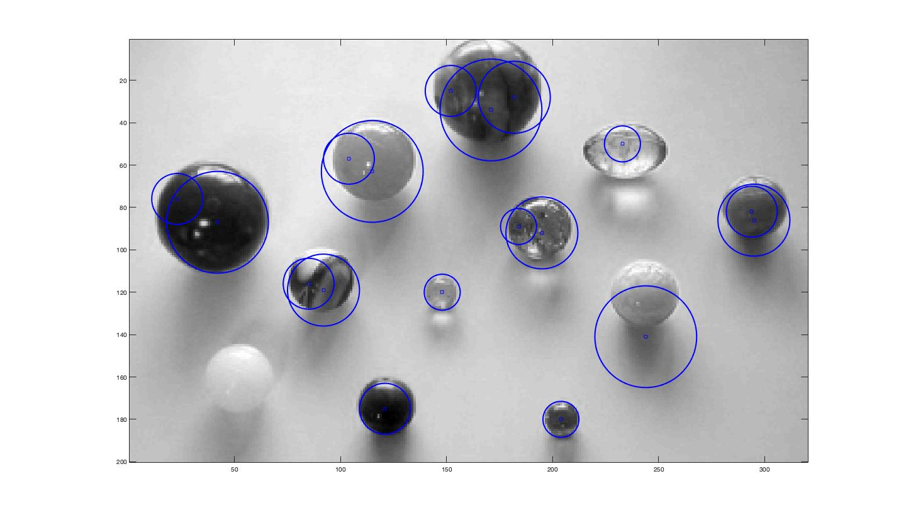

# Circle Finding <!-- title-->
* [Circle Finding](#circle-finding) <!-- list & wayfinder-->

## Circle Finding Algorithm <!-- title2-->
The project uses gabor filter and fourier analysis to find the circular shapes 
 <!-- image-->

## USE

## Technologies
Matlab
