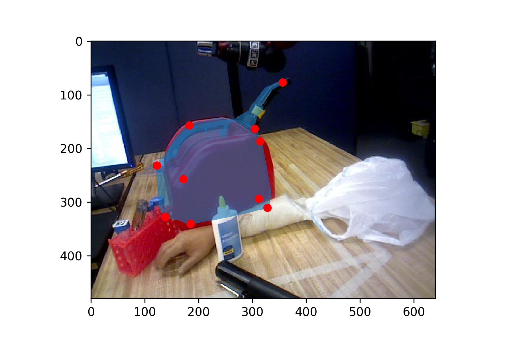

# Pose Matching
- [Brief](#project-brief)  
- [Use](#use)

## Project Brief
:pencil2:
The algorithm utilizes the least square method and computer vision concept to find the most possible rotation and translation matrix 
 <!-- image-->

## Use

## Technologies
Python, Colab 
