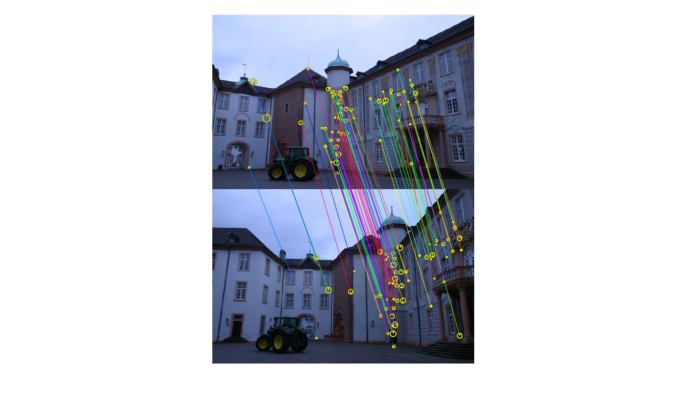
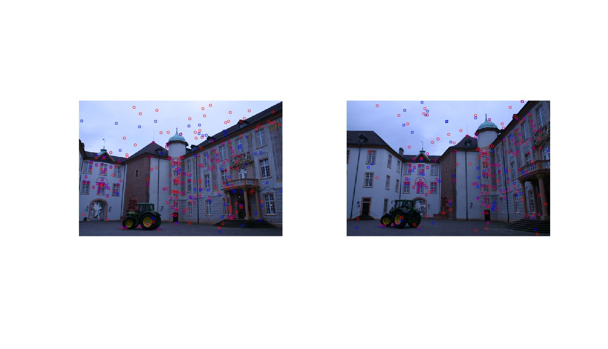

# RANSAC <!-- title-->
* [1.Epipolar](#draw-circle) <!-- list & wayfinder-->
* [2.RANSAC](#fit-circle)

## Epipolar <!-- title2-->
The project uses epipolar abstract to calculate the common position of the camera between two photos 
 <!-- image-->

## RANSAC
Then filters the most of the noisy data by RANSAC algorithm 

## USE

## Technologies
Matlab
